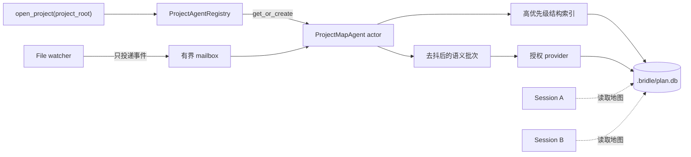
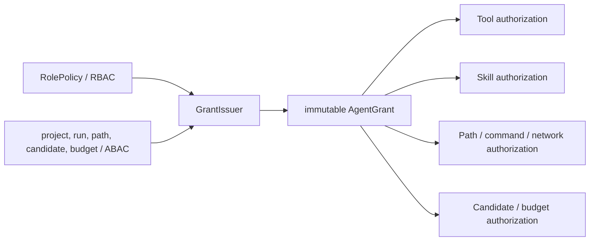
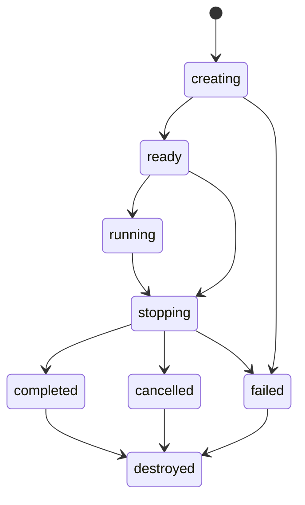

<!-- SCOPE: Bridle Agent Runtime 的目标架构、授权、生命周期、持久化边界与分阶段验收契约 -->
<!-- DOC_KIND: design -->
<!-- DOC_ROLE: canonical -->
<!-- READ_WHEN: 设计或修改项目级 Mapper、会话子 Agent、工具/Skill 授权、资源回收或 Agent 运行状态时 -->
<!-- SKIP_WHEN: 只需要当前已实现的通用系统结构、HTTP 字段或前端视觉规范时 -->
<!-- PRIMARY_SOURCES: .ai-dev/spec/agent-runtime-requirements.json, plan.md, backend/src/bridle/agent, backend/src/bridle/features/project_map -->
<!-- NO_CODE_EXAMPLES: 本文定义目标契约与边界，具体实现以源码和测试为准。 -->

# Agent Runtime 目标架构

> **状态：** Planned；本文不表示相关能力已经实现或验证。  
> **最后更新：** 2026-07-12

## Quick Navigation

| 目标 | 入口 |
|---|---|
| 区分 Agent 类型与归属 | [Agent 分类与所有权](#agent-分类与所有权) |
| 理解项目级 Mapper | [ProjectMapAgent 运行模型](#projectmapagent-运行模型) |
| 检查权限分配 | [RBAC、ABAC 与 Capability Grant](#rbacabac-与-capability-grant) |
| 检查创建和销毁 | [统一生命周期](#统一生命周期) |
| 确认持久化位置 | [数据归属](#数据归属) |
| 规划工具层接口 | [工具与 Skill 边界](#工具与-skill-边界) |
| 查看完成标准 | [验收与验证](#验收与验证) |

## Agent Entry

本文是 Agent Runtime 新架构的规划权威入口。先查看 [实现状态](implementation_status.md) 判断能力是否已经落地，再按需求 ID 追踪 `.ai-dev/spec/agent-runtime-requirements.json`。当前实现仍以源码为事实；本文中的目标组件、状态和表只有在对应测试通过并更新实现状态后，才能从 `Planned` 提升。

## 设计目标与边界

Agent Runtime 需要同时承载两种不同所有权模型：项目目录拥有的常驻 Mapper，以及某次会话或任务拥有的短生命周期子 Agent。两者复用授权、资源预算、日志和销毁协议，但不能共享生命周期主键，也不能把 Mapper 伪装成主 Agent 临时派发的会话节点。

本阶段不改变以下边界：

- 模型调用仍通过既有 provider 抽象；授权层只决定能否调用和使用哪一个候选，不重写 provider。
- 项目地图仍由 `features/project_map` 负责索引与查询；Runtime 负责 Mapper actor 的调度和权限，不复制地图算法。
- 工具实现继续由工具层持有；Runtime 颁发不可变授权并在调用前统一校验。
- Reviewer 角色保留在角色与授权模型中，具体工作流在后续批次实现。

## Agent 分类与所有权

| 类型 | 所有者 | 生命周期 | 主要职责 | 默认持久化范围 |
|---|---|---|---|---|
| `coordinator` | 会话 | 随会话运行 | 分解任务、创建会话子 Agent、汇总结果 | 主数据库的会话与运行事实 |
| `project_mapper` | 项目目录 | 从项目打开到应用关闭 | 接收文件事件、维护结构地图、批量触发语义刷新 | 项目 `.bridle/plan.db` |
| `implementer` | 某次 run / plan node | 任务型 | 在授权路径内修改并验证实现 | 主数据库的 run 与审计事实 |
| `verifier` | 某次 run / plan node | 任务型 | 只读检查、执行获批验证、返回证据 | 主数据库的 run 与审计事实 |
| `reviewer` | 某次 review run | 任务型 | 独立审查变更和证据 | 后续批次实现；当前只预留角色策略 |

会话子 Agent 的稳定归属键是 `run_id` 和可选 `plan_node_id`；Mapper 的稳定归属键是规范化 `project_root`。会话关闭不得销毁同一项目仍在使用的 Mapper。

## ProjectMapAgent 运行模型

`ProjectMapAgent` 是每个规范化项目目录最多一个的 resident actor。这里的“常驻”指 actor、邮箱和项目状态常驻，不代表持续占用一次模型请求。

运行契约：

- `ProjectAgentRegistry` 按规范化项目根目录提供幂等 `get_or_create`，并对并发打开进行 single-flight 合并。
- 文件 watcher 不直接写 store，只把规范化变更事件投递到有界邮箱；溢出时合并为一次全量 reconcile 信号，不无限增长。
- 结构索引通道优先且不依赖模型；语义通道去抖、批处理，并在调用 provider 前重新校验授权和预算。
- Mapper 持久化文件摘要与扫描 checkpoint，启动时对比磁盘以修复离线期间遗漏的变更。
- Mapper 失败不应终止普通会话；状态变为可观测的 `degraded`，结构索引可用时继续提供结构地图。

## RBAC、ABAC 与 Capability Grant

授权采用三层模型：RBAC 定义角色上限，ABAC 根据当前项目、run、路径和候选缩小范围，最终生成不可变 `AgentGrant`。运行中只消费 Grant，不重新拼接散落的布尔开关。

| 角色 | 工具与 Skill 上限 | 文件与命令上限 | Provider / 地图上限 |
|---|---|---|---|
| `coordinator` | 编排、计划和只读上下文工具；不得继承子 Agent 的写权限 | 项目只读，计划状态按 run 授权 | 可创建受限子 Grant；不能扩大权限 |
| `project_mapper` | 地图索引与映射 Skill | 项目只读；只写 `.bridle/plan.db` 管理数据 | 只允许 Mapper 候选与地图预算 |
| `implementer` | 按任务显式列出的修改和验证能力 | 仅授权路径；命令、网络分别列举 | 只读固定 `map_revision`，不能写地图状态 |
| `verifier` | 只读检查和获批测试工具 | 工作区只读；仅测试所需受控临时输出 | 不得修改计划或地图 |
| `reviewer` | 只读审查与证据工具 | 工作区只读 | 后续批次细化 |

所有授权点遵守以下不变量：

- 缺失权限、未知工具、未知 Skill、未知命令或路径越界一律拒绝。
- 子 Grant 必须是父 Grant 的严格子集；任何维度扩大都使创建失败。
- 工具注册表、Skill 注册表、沙箱、provider 选择与计划变更都调用同一授权服务，不能各自解释角色。
- Grant 绑定 `agent_id`、所有权键、`project_root`、有效期、预算和审计 ID；撤销后后续调用失败。
- 日志记录决策 ID、角色、资源类型、允许/拒绝与原因码，但不记录密钥、完整 prompt 或无界工具输出。

## 统一生命周期

项目 Mapper 与会话子 Agent 使用同一状态机，触发条件不同：

销毁必须幂等，并严格执行：停止接收输入 → 撤销 Grant → 完成或回滚原子事务 → 取消 provider 与工具任务 → 按 LIFO 释放资源 → 持久化唯一终态 → 发布一次终态事件 → 从活跃 registry 移除 handle。资源对象被销毁，审计事实、最终摘要和必要运行记录保留。

授权执行的启动边界使用 pending-start reservation：预约在 revocation lineage 锁内登记，`reservation.enter()` 是逻辑启动线性化点。revoke 阻止新预约并等待旧预约 enter/cancel，但不等待已逻辑启动的 handler 完成；handler 必须在 lineage 锁外执行，再由生命周期资源作用域负责取消或等待。因此“revoke 返回后无新启动”按预约线性化点判断，不依赖 callback 第一条指令与 revoke 线程的调度先后。

触发规则：

- 会话子 Agent 在成功、失败、取消、超时、父 run 终止或服务关闭时销毁。
- Mapper 只在项目显式卸载且没有引用，或应用关闭时销毁；会话结束不是 Mapper 销毁条件。
- 关闭超时后进入强制取消，但仍要完成撤权、终态持久化和 registry 清理。

## 数据归属

| 数据 | 目标位置 | 说明 |
|---|---|---|
| `agent_runs` | 主 workspace SQLite | 会话子 Agent 的所有权、角色、Grant 摘要、状态、时间、结果/错误摘要 |
| `map_agent_state` | `.bridle/plan.db` | Mapper actor 状态、地图 revision、checkpoint、降级原因 |
| `indexed_files` | `.bridle/plan.db` | 规范化路径、内容摘要、索引状态和最后处理 revision |
| 活跃 handle、task、mailbox | 进程内 registry | 不持久化不可恢复的运行对象；重启根据持久化事实重建 |

这些表是目标 schema，不属于 [当前数据库基线](database_schema.md) 中已经实现的三张业务表。实现前必须先定义模型、创建语义、恢复策略和测试，不能仅靠文档声明 schema 已可用。

## 工具与 Skill 边界

工具层应提供可授权的资源描述，而不是把角色判断硬编码进每个工具。Runtime 负责把 `AgentGrant` 传入统一调用入口，并在执行前后记录授权决策与资源用量。

- Tool 定义稳定 `tool_id`、风险类别、所需能力、路径/命令/网络参数提取规则和取消钩子。
- Skill 定义稳定 `skill_id`、允许角色、依赖工具与上下文模块；提示词只注入 Grant 允许的 Skill。
- Mapping Skill 只对 `project_mapper` 可用，负责结构/语义映射流程，不授予会话工具写地图的捷径。
- 资源跟踪器登记 provider 请求、工具任务、临时目录、锁和数据库事务，并按 LIFO 清理。
- 旧调用方迁移期间也必须 fail closed；不能用“未配置即允许”维持兼容。

## 观测与错误契约

创建、授权、运行、降级和销毁都通过既有 LoggingFacade 记录结构化事件。至少包含 `agent_id`、`agent_kind`、`owner_id`、`run_id`、`project_id/root_hash`、`grant_id`、`state_from`、`state_to`、`decision_id` 和稳定原因码。日志失败不得改变业务结果；敏感字段继续遵守现有脱敏边界。

对外错误区分：无权限、Grant 已撤销、父 Grant 不包含请求能力、资源预算耗尽、邮箱过载、关闭超时和恢复失败。内部异常可关联日志，但不能直接泄漏本地绝对路径之外的敏感输入、凭据或完整模型内容。

## 分阶段交付

1. 授权基础：建立角色策略、不可变 Grant、统一授权服务与 fail-closed 工具/Skill 入口。
2. 项目 Mapper：建立项目 registry、actor/mailbox、checkpoint/reconcile、结构优先与语义批处理。
3. 会话子 Agent：建立 run registry、创建/派发/汇总流程，并修复 plan node 状态衔接。
4. 生命周期收口：统一销毁、资源跟踪、终态事件和服务关闭协调。
5. Reviewer：在前述边界稳定后补充独立审查角色和工作流。

每个阶段必须独立完成 TDD、代码审查和对应范围验证，不能因为后续阶段尚未完成而放宽 fail-closed 或资源回收契约。

## 验收与验证

| 范围 | 必测行为 | 完成标准 |
|---|---|---|
| 授权 | 缺失权限、未知资源、路径越界、子 Grant 扩权 | 全部拒绝，并产生稳定原因码；合法最小 Grant 通过 |
| Mapper registry | 同一项目并发打开、不同会话共享、会话关闭、应用关闭 | 单实例、会话无所有权、只在项目卸载/应用关闭销毁 |
| Mapper mailbox | 高频变更、溢出、离线修改、语义 provider 失败 | 有界合并、启动 reconcile、结构地图继续可用、状态可观测 |
| 会话子 Agent | 创建、完成、失败、取消、父 run 终止 | 所有权正确，终态唯一，结果摘要可汇总 |
| 销毁 | 重复 stop、工具不响应、provider 取消、事务中断 | 幂等、撤权优先、LIFO 清理、无活跃 handle 泄漏 |
| 日志 | 允许/拒绝、状态迁移、降级与清理 | 字段完整、原因码稳定、无 secret 和完整 prompt |

精确验证命令随实现批次写入 `plan.md`，执行证据保存在 `.ai-dev/evidence/`。只有实际运行成功且评审无阻断 finding，才能在 [实现状态](implementation_status.md) 中提升相应条目。

## Maintenance

**Update Triggers:**

- Agent 类型、所有权或状态机发生变化。
- RBAC 角色上限、ABAC 属性、Grant 字段或 fail-closed 语义发生变化。
- Mapper 的项目归属、邮箱、checkpoint、语义刷新或降级策略发生变化。
- `agent_runs`、`map_agent_state`、`indexed_files` 的实现 schema 或恢复契约落地。
- 工具、Skill、provider、沙箱或计划操作接入新的授权点。

**Verification:**

- 对照 `.ai-dev/spec/agent-runtime-requirements.json` 检查所有 REQ、AC、SEC、NFR 与 OPS ID。
- 对照源码和测试确认文中 `Planned`、`Implemented`、`Verified` 状态没有提前提升。
- 检查同一项目只有一个 Mapper 所有者，且会话关闭不会触发其销毁。
- 检查未知或缺失授权在所有资源入口一致拒绝。
- 检查内部链接与文档 metadata 可解析。
