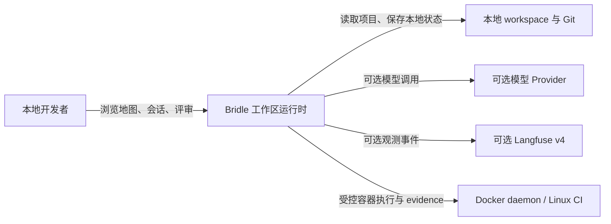
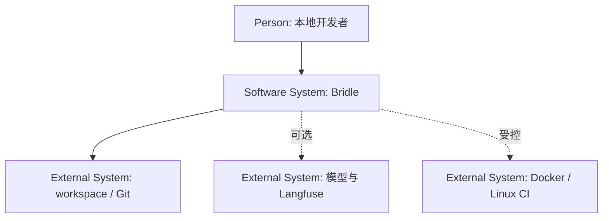
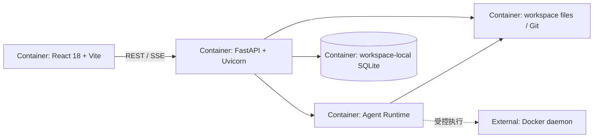
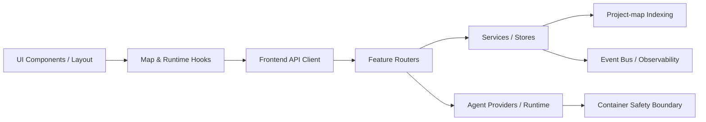
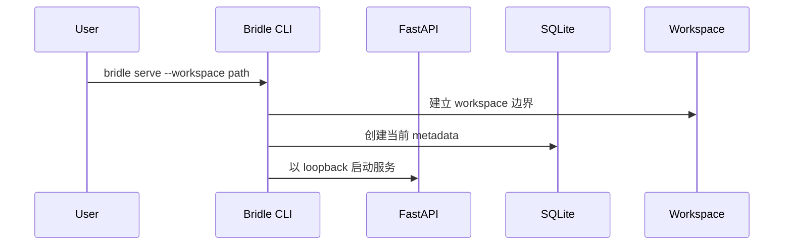
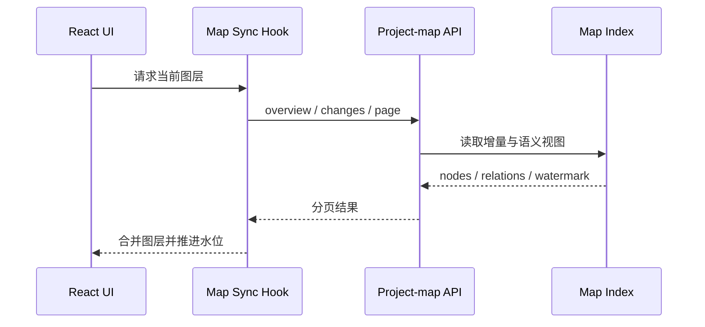
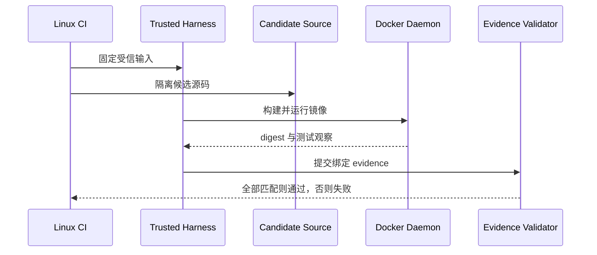
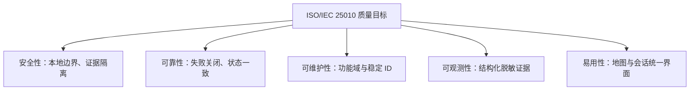

<!-- SCOPE: Bridle 当前系统边界、运行结构、架构决策与质量风险 -->
<!-- DOC_KIND: explanation -->
<!-- DOC_ROLE: canonical -->
<!-- READ_WHEN: 需要理解组件关系、关键运行链路、技术边界或变更影响时 -->
<!-- SKIP_WHEN: 只需要功能需求、API 字段或单个测试命令时 -->
<!-- PRIMARY_SOURCES: .ai-dev/docs/ln-110/context-store.json, docs/project/requirements.md, docs/reference/adrs -->

# 系统架构

## Quick Navigation

| 目标 | 入口 |
|---|---|
| 目标与约束 | [1. Introduction and Goals](#1-introduction-and-goals)、[2. Constraints](#2-constraints) |
| C4 边界 | [3. Context and Scope](#3-context-and-scope)、[5. Building Block View](#5-building-block-view) |
| 运行链路 | [6. Runtime View](#6-runtime-view) |
| Agent Runtime 目标设计 | [Agent Runtime](agent_runtime.md) |
| 横切策略与 ADR | [7. Crosscutting Concepts](#7-crosscutting-concepts)、[8. Architecture Decisions](#8-architecture-decisions-adrs) |
| 质量与风险 | [9. Quality Requirements](#9-quality-requirements)、[10. Risks and Technical Debt](#10-risks-and-technical-debt) |

## Agent Entry

本文按 arc42 的 11 个章节组织，并用 C4 Context、Container、Component 三层图表达当前结构。事实范围是单个本地 workspace：React 前端通过本地 FastAPI 服务访问项目地图、会话和工作区能力；SQLite 与项目文件均锚定 workspace；外部模型、Langfuse 和 Docker 是可选或受控边界。实现变化先更新相应 ADR 或需求，再同步本文件。

## 1. Introduction and Goals

### 1.1 Requirements Overview

Bridle 是 local-first 项目地图工作区运行时。核心能力由 [requirements.md](requirements.md) 定义：以 workspace 启动服务、索引并查询项目地图、持久化会话、驱动 Agent、在 React 界面同步地图，以及用受信证据链审查候选容器代码。

### 1.2 Quality Goals

| 优先级 | 质量目标 | 可验收标准 |
|---|---|---|
| 1 | 本地边界可控 | CLI 默认只绑定 loopback；workspace API 不越过当前根目录。 |
| 2 | 地图状态一致 | 后端项目地图与前端同步用例全部被门禁收集；缺失或失败即阻断。 |
| 3 | 容器审查可追溯 | trusted harness、candidate、镜像 digest、测试观察与 evidence 可分别核验。 |
| 4 | 业务与观测解耦 | 日志或 Langfuse 适配不改变业务返回值和控制面结果。 |
| 5 | 文档可复查 | canonical 文档无高等级质量问题，内部链接和当前仓库路径可解析。 |

### 1.3 Stakeholders

| 角色 | 关注点 |
|---|---|
| 本地开发者 | 快速打开 workspace、查看地图、运行会话并保留本地数据。 |
| 测试与评审者 | 从需求、测试合同、CASE ID 到 CI evidence 的完整追踪。 |
| CI 维护者 | 地图快速门禁与容器安全门禁的稳定边界、脱敏日志和失败诊断。 |
| 文档维护者 | canonical 事实不重复、路径有效、状态声明有证据。 |

## 2. Constraints

### 2.1 Technical Constraints

| 约束 | 当前事实 |
|---|---|
| 运行时 | 后端要求 Python 3.12+；前端使用兼容 Vite 5 的 Node.js 与 npm。 |
| 服务边界 | REST 位于 `/api/v1`，事件使用 server-sent events；默认 loopback。 |
| 持久化 | workspace-local SQLite；启动使用当前 metadata creation 语义。 |
| 容器证据 | 真实安全门禁需要 Linux runner 与 Docker daemon。 |
| 前端状态 | 服务端状态由 TanStack React Query 管理，地图同步封装在 hooks。 |

### 2.2 Organizational Constraints

文档阶段只更新 `docs/**/*.md` 和指定审计产物。CI Author 只能修改需求基线列出的 workflow、verification script 与 CI 审计三类路径前缀，不得修改产品代码或业务测试。远程 Issue、Actions、提交、推送、PR 和发布均需要独立授权。

### 2.3 Conventions and Compliance

项目使用功能域 FastAPI routers、service/store 分层、TypeScript/React hooks 和结构化日志。中文内容必须经过 UTF-8 真实内容检查。当前资料未记录 GDPR、HIPAA 等专门法规适用性，因此本架构不声明未确认的合规认证。

## 3. Context and Scope

### 3.1 Business Context

### 3.2 Technical Context

| 外部边界 | 协议或接口 | 数据方向 |
|---|---|---|
| 浏览器前端 | HTTP REST、SSE | 读取地图与会话，提交消息和刷新请求。 |
| 本地 workspace | 文件系统、Git | 读取源码与结构，维护项目身份和工作区状态。 |
| SQLite | SQLAlchemy async、aiosqlite | 保存 projects、project_sessions、project_messages。 |
| 模型 Provider | `BRIDLE_AGENT_*` 配置的 HTTP 边界 | 可选请求与响应。 |
| Langfuse v4 | 可选观测适配 | 发送脱敏 trace 与 span 信息。 |
| Docker daemon | Docker CLI/API | 构建隔离镜像、执行测试、收集绑定证据。 |

## 4. Solution Strategy

### 4.1 Technology Decisions

| 决策 | 策略 | ADR |
|---|---|---|
| 后端 API | FastAPI + Uvicorn，按功能域组织 routers。 | [ADR-001](../reference/adrs/adr-001-fastapi-backend.md) |
| 本地持久化 | SQLite + SQLAlchemy async，以 workspace 为锚点。 | [ADR-002](../reference/adrs/adr-002-local-sqlite-sqlalchemy.md) |
| 前端 | React + Vite，服务端状态与同步逻辑放入 hooks。 | [ADR-003](../reference/adrs/adr-003-react-vite-frontend.md) |
| 可观测 | 结构化项目日志加可选 Langfuse v4 adapter。 | [ADR-004](../reference/adrs/adr-004-langfuse-v4-observability.md) |
| 容器审查 | trusted controller 与 untrusted candidate 分离，evidence fail-closed。 | [ADR-005](../reference/adrs/adr-005-trusted-docker-gate.md) |

### 4.2 Decomposition Approach

后端按 `projects`、`project_map`、`sessions`、`workspace`、`system` 功能域分解，Agent 运行时再分为 container、context、memory、providers、runtime、safety、skills 和 tools。前端按 api、components、hooks、layout、lib 分解。跨层交互通过 API schema、事件总线和结构化观测 facade 连接。

### 4.3 Delivery Strategy

普通开发环境先运行平台无关的 pytest 与 Vitest；真实容器安全行为在 Linux/Docker trusted evidence gate 中完成。地图与容器门禁只能在测试合同、真实 RED、最小 GREEN 和 clean review 证据齐备后编入 CI 目录。

## 5. Building Block View

### 5.1 C4 Level 1 — System Context

### 5.2 C4 Level 2 — Containers

### 5.3 C4 Level 3 — Components

| 构件 | 责任 | 主要位置 |
|---|---|---|
| App / CLI | 创建服务、绑定 workspace、注册功能入口。 | `backend/src/bridle/app.py`, `backend/src/bridle/cli.py` |
| Feature Routers | 暴露 projects、project_map、sessions、workspace、system API。 | `backend/src/bridle/features` |
| Service / Store | 承载业务编排、本地持久化和项目状态。 | `backend/src/bridle/features` |
| Project-map Indexing | 生成增量与语义项目地图，暴露关系、候选和刷新入口。 | `backend/src/bridle/features/project_map` |
| Agent Runtime | 当前管理 provider、上下文、内存、工具、安全与容器执行；项目 Mapper、会话子 Agent、统一 Grant 与销毁协议仍为 [Planned 目标设计](agent_runtime.md)。 | `backend/src/bridle/agent` |
| Frontend Hooks | 协调地图分页、水位、重试、取消和运行时数据。 | `frontend/src/hooks` |
| UI / Layout | 组合地图、workspace、会话输入和检查器。 | `frontend/src/components`, `frontend/src/layout` |

## 6. Runtime View

### 6.1 打开 Workspace

### 6.2 地图同步

### 6.3 容器证据门禁

## 7. Crosscutting Concepts

### 7.1 Security

Bridle 当前没有应用级认证层，安全基础是本地默认 loopback 与 workspace 根边界。外部模型、Langfuse 和 Docker 都不是默认业务成功的必要条件。容器链把受信控制器、候选源码、镜像身份、daemon 身份、测试观察和最终 evidence 分开校验，任何缺失、重复、不匹配或篡改均应 fail-closed。

### 7.2 Error Handling

FastAPI 边界把业务错误转换为稳定的状态码、错误代码、消息和详情；请求校验错误使用 `validation_error` 并保留字段位置、消息和类型。CI 和本地验证同样保留阶段、命令、耗时、退出状态与脱敏失败摘要，使失败可定位，同时不把凭据或完整对话写入产物。

### 7.3 Configuration

workspace、Agent provider/model/API、Langfuse、代理与容器 runner 均通过明确环境变量或 CLI 参数进入运行时。默认路径必须保持本地可运行，真实 provider 与 observability 是可选能力。配置记录应显示是否启用某边界，但不得输出 API key、secret 或未脱敏请求内容。

### 7.4 Data Access

SQLite 使用 SQLAlchemy async 与 aiosqlite，保存项目身份、项目会话和消息；项目源码与 Git 状态保留在 workspace 文件系统。当前启动路径使用 metadata creation，不具备已确认的完整迁移工作流。地图索引与会话数据通过各自 service/store 访问，避免 UI 或 router 直接操作持久化细节。

## 8. Architecture Decisions (ADRs)

### 8.1 ADR Index

| ADR | 决策 |
|---|---|
| [ADR-001](../reference/adrs/adr-001-fastapi-backend.md) | FastAPI 后端运行时 |
| [ADR-002](../reference/adrs/adr-002-local-sqlite-sqlalchemy.md) | 本地 SQLite 与 SQLAlchemy async |
| [ADR-003](../reference/adrs/adr-003-react-vite-frontend.md) | React 与 Vite 前端 |
| [ADR-004](../reference/adrs/adr-004-langfuse-v4-observability.md) | Langfuse v4 可观测适配 |
| [ADR-005](../reference/adrs/adr-005-trusted-docker-gate.md) | 受信 Docker 安全门禁 |

### 8.2 Critical ADRs Summary

ADR-001 到 ADR-003 定义主运行栈与本地数据边界；ADR-004 保证外部观测保持可选且不污染业务控制面；ADR-005 定义候选代码不能控制受信测试与证据判定。变更这些边界时，应先更新或新增 ADR，再修改实现与本文件。

## 9. Quality Requirements

### 9.1 Quality Tree

### 9.2 Quality Scenarios

| 场景 | 刺激 | 预期响应 |
|---|---|---|
| 非本地绑定 | 用户请求非 loopback host | CLI 拒绝启动并返回可理解原因。 |
| 地图用例丢失 | 已评审 CASE 未被 pytest 或 Vitest 收集 | 地图 job 失败并指出缺失 CASE。 |
| evidence 被篡改 | digest、观察或来源指纹不匹配 | 容器 job fail-closed 并保留脱敏诊断。 |
| 观测端不可用 | Langfuse adapter 无法发送 | 业务结果不被改写，日志说明可选观测失败。 |
| 文档引用陈旧 | canonical 文档链接或源码路径失效 | docs-quality gate 产生高等级 finding 并阻断发布。 |

## 10. Risks and Technical Debt

### 10.1 Risks

| 风险 | 可能性 | 影响 | 缓解 |
|---|---|---|---|
| 应用无认证而被暴露到非本地网络 | 中 | 高 | 保持 loopback 默认与 CLI 拒绝边界；未来暴露前新增独立安全决策。 |
| 地图后端与前端同步合同漂移 | 中 | 高 | 建立覆盖两端的稳定 CASE 目录与缺失收集检查。 |
| 候选代码影响受信 harness 或 evidence | 低 | 高 | 保持 trusted/candidate 分离、digest 和 daemon identity 绑定。 |
| 外部 provider 或观测进入启动关键路径 | 中 | 中 | 保持 fake/stub 默认与可选 adapter。 |

### 10.2 Technical Debt

| 项目 | 当前状态 | 处理边界 |
|---|---|---|
| 数据库迁移 | 没有活动迁移工作流，启动使用 metadata creation。 | schema 演进前建立单独 ADR 与迁移验证，不在文档中美化现状。 |
| 地图 CI 门禁 | Context Store 记录为尚未存在。 | 只在测试合同与 clean review 后由 CI Author 创建。 |
| 应用级认证 | 当前未实现。 | 保持 local-first；任何远程暴露需求先做威胁建模。 |
| 模式审计 | [patterns_catalog.md](../architecture/patterns_catalog.md) 中模式仅为 Detected。 | 使用独立审计升级分数，不把自动发现当作决策。 |

### 10.3 Evolution Priorities

先完成地图与容器 CI 的测试合同、证据和门禁，再考虑扩大部署边界。任何数据库迁移、远程访问或多 workspace 并发能力都属于新的架构决策，不能从当前 local-first 结构静默推导。

## 11. Glossary

| 术语 | 定义 |
|---|---|
| Workspace | Bridle 当前运行、索引、持久化与权限判断的本地项目根。 |
| Project Map | 代码实体、关系、语义标注、边界、候选与执行态组成的项目视图。 |
| Watermark | 前端增量同步用于确认已消费变化位置的进度标记。 |
| Trusted Harness | 不由候选代码控制的测试、镜像构建和证据判定逻辑。 |
| Candidate | 被审查的源码与其派生镜像。 |
| Evidence | 绑定来源、镜像身份、测试观察与验证结果的审计数据。 |
| C4 | Context、Container、Component 与 Code 四层架构表达方法；本文使用前三层。 |
| arc42 | 本文采用的 11 章节架构文档结构。 |

## Maintenance

**Last Updated:** 2026-07-11

**Update Triggers:**

- 新增功能域、外部系统、数据存储、部署边界或认证机制。
- API、SSE、地图同步、Agent provider 或容器 evidence 链发生结构变化。
- ADR 被接受、替代或废弃。

**Verification:**

- 三个 C4 Mermaid 图与当前 `SRC_STRUCTURE` 一致。
- 11 个 arc42 章节完整，ADR 链接可解析。
- 风险与技术债只描述已知事实，不把计划写成已验证结果。
