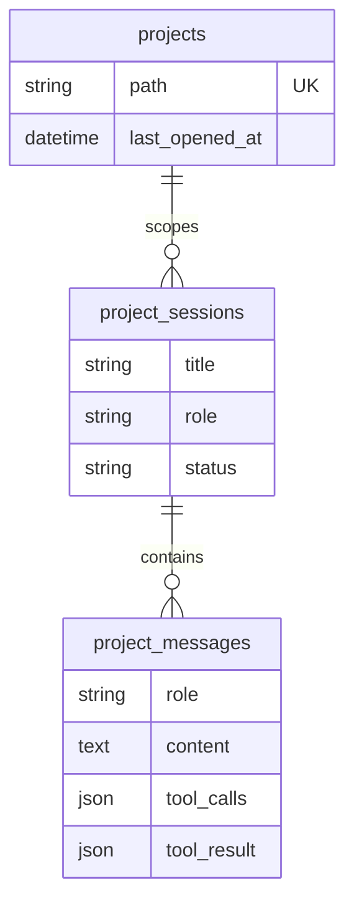

# 数据库结构：Bridle

<!-- SCOPE: 当前工作区本地 SQLite 的三张持久化表、逻辑关系与迁移状态。 -->
<!-- DOC_KIND: reference -->
<!-- DOC_ROLE: canonical -->
<!-- READ_WHEN: 需要确认 Bridle 持久化实体、已知字段、逻辑关系或 schema 生命周期时阅读。 -->
<!-- SKIP_WHEN: 只需要 HTTP API 路径、前端状态或部署拓扑时跳过。 -->
<!-- PRIMARY_SOURCES: .ai-dev/docs/ln-110/context-store.json -->

> **状态：** 当前事实基线  
> **最后更新：** 2026-07-11

## Quick Navigation

- [文档中心](../README.md)
- [API 契约](api_spec.md)
- [架构](architecture.md)
- [Agent Runtime 目标设计](agent_runtime.md)
- [技术栈](tech_stack.md)
- [运行手册](runbook.md)

## Agent Entry

| 信号 | 内容 |
|---|---|
| 用途 | 记录工作区本地 SQLite 的三张表、概念字段、逻辑关系与迁移边界。 |
| 何时阅读 | 修改持久化语义、判断数据归属或评估 schema 变化时。 |
| 何时跳过 | 只需要 API 方法、路径或请求行为时。 |
| 规范性 | 是；只声明 Context Store 已确认的持久化事实。 |
| 下一步 | [API 契约](api_spec.md)、[架构](architecture.md)、[技术栈](tech_stack.md) |
| 事实来源 | `.ai-dev/docs/ln-110/context-store.json` |

## 1. Database Overview

| 属性 | 当前值 |
|---|---|
| 数据库 | 工作区本地 SQLite。 |
| ORM | SQLAlchemy async 2.0 或更高版本。 |
| 驱动 | aiosqlite 0.20 或更高版本。 |
| 表数量 | 三张：`projects`、`project_sessions`、`project_messages`。 |
| 迁移状态 | 没有活动的版本化迁移工作流。 |
| 启动行为 | 使用当前 metadata creation 语义确保当前 schema 可用。 |

数据库属于工作区本地持久化，不应从本文推断集中式数据库、远程数据库服务或跨工作区共享。

Agent Runtime 规划中的 `agent_runs`、`map_agent_state` 与 `indexed_files` 尚不属于本页当前三表基线；其目标归属与恢复契约见 [Agent Runtime 目标设计](agent_runtime.md#数据归属)。只有源码、schema 创建语义和测试全部落地后，本页才会将其计入当前表数量。

## 2. Entity Relationship

下图表达 Context Store 可证明的逻辑归属，不额外声明外键名称、删除级联或索引实现。

## 3. Table Definitions

### 3.1 `projects`

| Known field or concept | Contract |
|---|---|
| `path` | 项目的稳定路径标识；Context Store 明确其唯一性。 |
| `last_opened_at` | 记录项目最近打开时间。 |

该表保存稳定项目身份。Context Store 未提供主键列名、字段长度或其他时间戳字段，本文不补猜。

### 3.2 `project_sessions`

| Known field or concept | Contract |
|---|---|
| `title` | 项目范围内的会话标题。 |
| `role` | 会话角色。 |
| `status` | 会话状态。 |

该表保存项目范围内的对话会话。Context Store 未提供默认值、枚举范围、外键列名或时间字段。

### 3.3 `project_messages`

| Known field or concept | Contract |
|---|---|
| `role` | 消息角色。 |
| `content` | 消息正文。 |
| `tool_calls` | 与消息关联的工具调用结构。 |
| `tool_result` | 与消息关联的工具结果结构。 |
| 消息时间戳 | 存在消息相关时间戳；Context Store 未保存具体列名。 |

该表保存会话消息。Context Store 未提供主键、会话引用列、JSON 可空性或字段默认值。

## 4. Relationship Rules

| Parent | Child | Confirmed meaning | Not asserted here |
|---|---|---|---|
| `projects` | `project_sessions` | 会话属于项目范围。 | 外键列名、删除级联、加载策略。 |
| `project_sessions` | `project_messages` | 消息属于会话。 | 外键列名、删除级联、排序实现。 |

这些是业务逻辑关系。只有在 Context Store 增加模型级证据后，本文才应记录物理约束。

## 5. Migration Status

当前没有活动的版本化迁移工作流。启动过程采用当前 metadata creation 语义；该行为只能确保当前 metadata 对应结构可创建，不能替代历史 schema 的升级、数据转换或回滚。

对 schema 的操作边界：

- 不把已安装的数据库工具或依赖等同于可用的迁移链。
- 不在没有正式迁移流程时声明自动升级或回滚能力。
- 不执行推测性的删表、重建或数据转换命令。
- schema 发生不兼容变化前，必须先建立可验证的迁移与恢复契约。

## 6. Data & Secret Boundary

| Concern | Rule |
|---|---|
| 数据位置 | 保持工作区本地 SQLite 语义。 |
| 环境文件 | 不读取、复制或发布 `backend/.env` 的值。 |
| 密钥 | 数据库文档不记录模型提供方、观测或其他外部系统密钥。 |
| 备份/恢复 | Context Store 未登记命令，因此本文不提供推测性步骤。 |

## Maintenance

**Last Updated:** 2026-07-11

**Update Triggers:**

- 三张表的职责、已知字段或逻辑关系发生变化。
- SQLite、SQLAlchemy async 或 aiosqlite 选型变化。
- 引入正式版本化迁移、数据转换、备份或恢复流程。
- Context Store 增加主键、外键、索引、默认值或字段类型证据。

**Verification：**

- 逐项对照 `.ai-dev/docs/ln-110/context-store.json` 的 `DATABASE_TYPE`、`SCHEMA_OVERVIEW` 与 `TECH_STACK.database`。
- ER 图只表达三张表的逻辑归属，不暗示未核验的物理约束。
- 不读取 `backend/.env`，也不记录任何环境值或密钥。
- 不把 metadata creation 描述成版本化迁移工作流。
