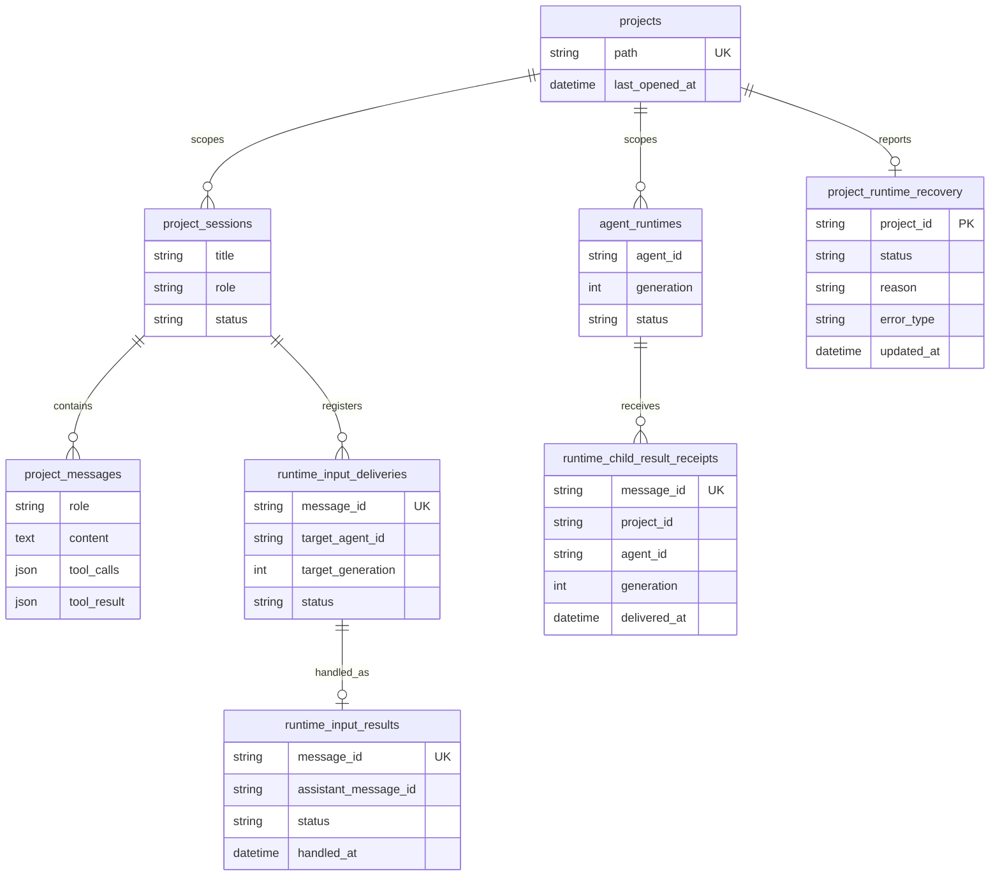

# 数据库结构：Bridle

<!-- SCOPE: 当前工作区应用 SQLite 与项目本地 SQLite 事实基线，以及已实现的 Runtime、Mail、Outbox、Map 与应用级恢复边界。 -->
<!-- DOC_KIND: reference -->
<!-- DOC_ROLE: canonical -->
<!-- READ_WHEN: 需要确认 Bridle 持久化实体、已知字段、逻辑关系或 schema 生命周期时阅读。 -->
<!-- SKIP_WHEN: 只需要 HTTP API 路径、前端状态或部署拓扑时跳过。 -->
<!-- PRIMARY_SOURCES: .ai-dev/docs/ln-110/context-store.json, .ai-dev/evidence/requirements-agent-runtime-mail-map-20260713.json -->

> **状态：** 当前事实基线  
> **最后更新：** 2026-07-15

## Quick Navigation

- [文档中心](../README.md)
- [API 契约](api_spec.md)
- [架构](architecture.md)
- [Agent Runtime 目标设计](agent_runtime.md)
- [技术栈](tech_stack.md)
- [运行手册](runbook.md)

## Agent Entry

| 信号 | 内容 |
|---|---|
| 用途 | 记录应用 SQLite 的八张已实现表与项目 `.bridle` 三个已隔离 SQLite store，以及 AR-07 已实现的逐项目恢复与降级事实。 |
| 何时阅读 | 修改持久化语义、判断数据归属或评估 schema 变化时。 |
| 何时跳过 | 只需要 API 方法、路径或请求行为时。 |
| 规范性 | 是；只声明 Context Store 已确认的持久化事实。 |
| 下一步 | [API 契约](api_spec.md)、[架构](architecture.md)、[技术栈](tech_stack.md) |
| 事实来源 | `.ai-dev/docs/ln-110/context-store.json`；`.ai-dev/evidence/requirements-agent-runtime-mail-map-20260713.json` |

### BATCH-AR-01 应用库表

`agent_runtimes`、`runtime_input_deliveries`、`runtime_input_results` 与 `runtime_child_result_receipts` 已由 SQLAlchemy metadata creation 纳入应用 SQLite。四者分别保存每个 `agent_id + generation` 的 Runtime 事实、会话消息到 Runtime 输入的稳定投递登记、按稳定 `message_id` 幂等关联的处理结果，以及跨协调器重启仍有效的子结果交付回执。结果与回执使用独立表，因此已有 delivery 表可由 `create_all` 保留，同时创建新增表。Mail 的 lease、ACK 与 NACK 仍只属于每项目 `.bridle/mail.db`。

## 1. Database Overview

| 属性 | 当前值 |
|---|---|
| 数据库 | 工作区本地 SQLite。 |
| ORM | SQLAlchemy async 2.0 或更高版本。 |
| 驱动 | aiosqlite 0.20 或更高版本。 |
| 表数量 | 八张：`projects`、`project_sessions`、`project_messages`、`agent_runtimes`、`runtime_input_deliveries`、`runtime_input_results`、`runtime_child_result_receipts`、`project_runtime_recovery`。 |
| 迁移状态 | 没有活动的版本化迁移工作流。 |
| 启动行为 | 使用当前 metadata creation 语义确保当前 schema 可用。 |

数据库属于工作区本地持久化，不应从本文推断集中式数据库、远程数据库服务或跨工作区共享。

项目本地 SQLite 的基础 schema、Mailbox 传输、正式补丁 Outbox、按需 Map Runtime、跨项目启动恢复与统一关闭顺序均已落地：

| 当前/规划数据 | 数据库 | 必须保持的边界 |
|---|---|---|
| Runtime 记录 | 既有应用 SQLite | 已实现 `agent_runtimes`、`runtime_input_deliveries`、`runtime_input_results` 与 `runtime_child_result_receipts`；统一 `AgentRuntimeHost` 持久化父、子、Map Runtime 的创建、迁移与销毁，且与项目、会话、消息处于同一应用数据库 |
| 项目 Runtime 恢复降级 | 既有应用 SQLite | `project_runtime_recovery` 只保存逐项目恢复失败的 `status/reason/error_type/updated_at`；成功恢复或再次打开项目时清除，不把路径、Mail、Outbox 或 Map 内容复制进应用库 |
| Memory | 既有会话消息/Memory 体系 | 不与 Runtime 状态或 Mail envelope 混为同一概念 |
| Mail 传输状态 | 每项目 `.bridle/mail.db` | 已实现 `metadata`、`mail_messages`、持久化 enqueue/claim、lease 续期与 fencing、ACK/NACK、无限重试、到期唤醒和 close lease 释放；Map handler 通过统一 Host 按需消费，Mail 不保存 Runtime 或 Map 业务事实 |
| CodeChanged 转发状态 | 每项目 `.bridle/change_outbox.db` | 已实现 `metadata` 与 `change_outbox_entries`，正式单文件原子提交先持久化 READY intent，再幂等转发到 Mail；满载、busy 或进程中断保留可恢复状态 |
| 地图、Map 消息与子任务结果回执 | 每项目 `.bridle/plan.db` | Map schema 包含 `metadata.store_kind=plan`、`map_applied_messages(message_id, applied_at)`、`child_spawn_facts` 与 `child_result_receipts(message_id, node_id, result_status, applied_at)`；Map 刷新与消息回执在同一事务中提交，重复 `message_id` 不重复增加 `change_seq`，处理失败持久化 `scan_status=stale` 与精确原因 |

具体可靠性、恢复和幂等合同见 [Agent Runtime 目标设计](agent_runtime.md#数据归属)。这些数据库在项目 `.bridle` 下按职责分离，不能合并成一个 Mail 或通用状态库。

## 2. Entity Relationship

下图表达 Context Store 可证明的逻辑归属，不额外声明外键名称、删除级联或索引实现。

## 3. Table Definitions

### 3.1 `projects`

| Known field or concept | Contract |
|---|---|
| `path` | 项目的稳定路径标识；Context Store 明确其唯一性。 |
| `last_opened_at` | 记录项目最近打开时间。 |

该表保存稳定项目身份。Context Store 未提供主键列名、字段长度或其他时间戳字段，本文不补猜。

### 3.2 `project_sessions`

| Known field or concept | Contract |
|---|---|
| `title` | 项目范围内的会话标题。 |
| `role` | 会话角色。 |
| `status` | 会话状态。 |

该表保存项目范围内的对话会话。Context Store 未提供默认值、枚举范围、外键列名或时间字段。

### 3.3 `project_messages`

| Known field or concept | Contract |
|---|---|
| `role` | 消息角色。 |
| `content` | 消息正文。 |
| `tool_calls` | 与消息关联的工具调用结构。 |
| `tool_result` | 与消息关联的工具结果结构。 |
| 消息时间戳 | 存在消息相关时间戳；Context Store 未保存具体列名。 |

该表保存会话消息。Context Store 未提供主键、会话引用列、JSON 可空性或字段默认值。

### 3.4 `agent_runtimes`

| Known field or concept | Contract |
|---|---|
| `agent_id`, `generation` | 联合唯一，标识同一 Agent 的不可混用代际。 |
| `runtime_type`, `owner_type`, `owner_id` | 记录 Runtime 类型及所有者。 |
| `project_id`, `session_id`, `parent_agent_id` | 记录可空的项目、会话和父 Agent 关联。 |
| `status`, `result_summary`, `error_summary` | 保存状态及有界结果/错误摘要。 |

### 3.5 `runtime_input_deliveries`

| Known field or concept | Contract |
|---|---|
| `message_id` | 全表唯一的稳定投递标识。 |
| `session_message_id`, `project_id`, `session_id` | 关联会话消息及其项目/会话。 |
| `target_address`, `target_agent_id`, `target_generation` | 固定目标 Runtime 地址与代际。 |
| `status`, `attempt`, `mail_enqueued_at` | 保存应用侧投递状态、执行次数与入 Mail 时间；不保存 Mail lease 或 ACK/NACK。 |

### 3.6 `runtime_input_results`

| Known field or concept | Contract |
|---|---|
| `message_id` | 全表唯一，幂等关联一个已处理 Runtime 输入。 |
| `assistant_message_id` | 关联同一事务中生成的 assistant 会话消息。 |
| `status`, `handled_at` | 保存处理结果状态与完成时间。 |

该表独立于 delivery 表，使旧数据库无需为 delivery 执行不受 `create_all` 支持的新增列迁移。

### 3.7 `runtime_child_result_receipts`

| Known field or concept | Contract |
|---|---|
| `message_id` | 全表唯一，标识一个已完成的子结果交付。 |
| `project_id`, `agent_id`, `generation` | 记录接收结果的父 Runtime 项目、Agent 与代际。 |
| `delivered_at` | 记录结果已持久投递完成的时间。 |

该表让新建 Coordinator 在进程内缓存为空时仍可识别重复子结果，避免再次更新父代或重复销毁子代。

### 3.8 `project_runtime_recovery`

| Known field or concept | Contract |
|---|---|
| `project_id` | 主键并关联 `projects.id`，每个项目最多一条当前恢复降级事实。 |
| `status` | 当前固定为 `degraded`，供既有 ProjectRead readiness 映射。 |
| `reason`, `error_type` | 保存有界、脱敏的恢复失败原因与异常类型，不保存项目路径或消息 payload。 |
| `updated_at` | 记录最近一次降级事实更新时间。 |

应用启动使用 `checkfirst` 只新增该表，不对既有 `projects`、会话或 Runtime 表执行 `ALTER`；健康项目恢复成功后删除对应降级行。

## 4. Relationship Rules

| Parent | Child | Confirmed meaning | Not asserted here |
|---|---|---|---|
| `projects` | `project_sessions` | 会话属于项目范围。 | 外键列名、删除级联、加载策略。 |
| `project_sessions` | `project_messages` | 消息属于会话。 | 外键列名、删除级联、排序实现。 |

这些是业务逻辑关系。只有在 Context Store 增加模型级证据后，本文才应记录物理约束。

## 5. Migration Status

当前没有活动的版本化迁移工作流。启动过程采用当前 metadata creation 语义，并以 `checkfirst` 兼容地新增 `project_runtime_recovery`；该行为不能替代通用历史 schema 升级、数据转换或回滚。

对 schema 的操作边界：

- 不把已安装的数据库工具或依赖等同于可用的迁移链。
- 不在没有正式迁移流程时声明自动升级或回滚能力。
- 不执行推测性的删表、重建或数据转换命令。
- schema 发生不兼容变化前，必须先建立可验证的迁移与恢复契约。

## 6. Data & Secret Boundary

| Concern | Rule |
|---|---|
| 数据位置 | 保持工作区本地 SQLite 语义。 |
| 项目本地状态 | Mail、Outbox 与 Map 基础 store 分别位于项目 `.bridle`；`.bridle/**` 不进入代码索引或 `CodeChanged`。 |
| 环境文件 | 不读取、复制或发布 `backend/.env` 的值。 |
| 密钥 | 数据库文档不记录模型提供方、观测或其他外部系统密钥。 |
| 备份/恢复 | Context Store 未登记命令，因此本文不提供推测性步骤。 |

## Maintenance

**Last Updated:** 2026-07-15

**Update Triggers:**

- 八张应用表或三个项目本地 store 的职责、已知字段或逻辑关系发生变化。
- SQLite、SQLAlchemy async 或 aiosqlite 选型变化。
- 引入正式版本化迁移、数据转换、备份或恢复流程。
- Context Store 增加主键、外键、索引、默认值或字段类型证据。
- Runtime、Mail、Outbox 或 Map 的目标 schema、创建、恢复或迁移合同落地。

**Verification：**

- 逐项对照 `.ai-dev/docs/ln-110/context-store.json` 的 `DATABASE_TYPE`、`SCHEMA_OVERVIEW` 与 `TECH_STACK.database`。
- ER 图只表达应用表的逻辑归属，不暗示未核验的物理外键约束。
- 不读取 `backend/.env`，也不记录任何环境值或密钥。
- 不把 metadata creation 描述成版本化迁移工作流。
- 应用表与项目本地 store 明确分开，Mail、Outbox、Map 和应用数据没有混库。
